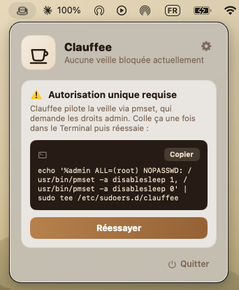
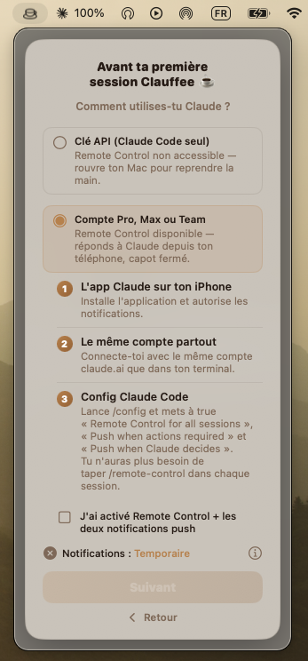
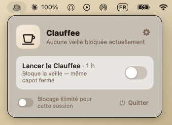
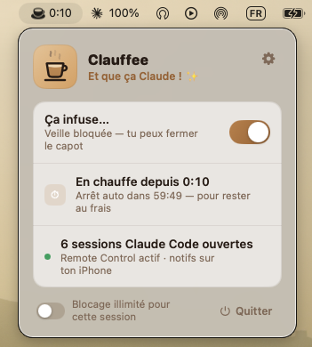
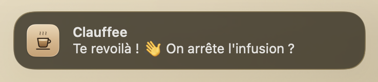
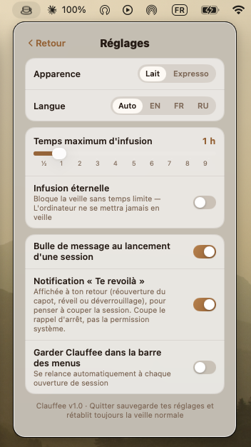

<p align="center">
  
</p>

# Clauffee ☕

A tiny macOS **menu-bar app that keeps your Mac awake** — even with the lid
closed — so your long-running terminal sessions (e.g. Claude Code) keep going
while you step away. Toggle **Start Brew**, shut the lid, walk off.

- 🛡️ Blocks sleep via `pmset disablesleep` — works lid-closed
- ⏱️ Optional auto-off time limit (1–9 h) or **Eternal brew** (never sleep)
- 🔒 **Locks the screen** when you close the lid (stays awake, but secure)
- 🔔 "You're back" notification when you reopen the lid
- ☕ Animated cup, light/dark themes, EN / FR / RU
- 🪶 Lives in the menu bar (no Dock icon)

> Clauffee only **keeps the Mac awake**. Push notifications to your phone
> come from Claude Code's own Remote Control feature — see the in-app
> onboarding for the one-time `/config` setup.

## Download

Grab the latest **`Clauffee-<version>.dmg`** (or **`.zip`**) from the
[**Releases**](https://github.com/axt3m/Clauffee/releases) page — no need to
build it yourself. Works on both Apple Silicon and Intel Macs.

1. Open the **`.dmg`** and drag **Clauffee.app** onto the **Applications**
   shortcut (or, with the `.zip`, unzip and move **Clauffee.app** into
   `/Applications`).
2. Because the app isn't notarized by Apple, macOS blocks it on first launch.
   **Right-click Clauffee.app → Open → Open** (you only do this once).
3. ☕ appears in your menu bar.

That's it — **no manual setup needed in advance**. On your first brew,
Clauffee's onboarding walks you through everything: enabling notifications
and a one-time admin command it shows you (with a **Copy** button). See
[what to expect](#first-brew--what-clauffee-asks-you) below.

## Requirements

- macOS 14 (Sonoma) or later — to run
- Xcode 16+ — only if you want to build it yourself

## Build & run

```sh
git clone https://github.com/axt3m/Clauffee.git
cd Clauffee
open Clauffee.xcodeproj
```

In Xcode:

1. Select the **Clauffee** target → **Signing & Capabilities** → choose **your
   own Team** (the project ships with no team set, so you must pick one — even
   "Sign to Run Locally" works for personal use).
2. Press **⌘R**.

## First brew — what Clauffee asks you

**You don't need to prepare anything.** The in-app onboarding guides you the
first time you brew — this section is just so you know what's coming (and can
inspect the admin command up front, since it's open source).

Clauffee toggles sleep with `pmset`, which needs admin rights. To avoid a
password prompt every time, it uses a passwordless `sudo` rule. Clauffee shows
you this exact command in-app (with a **Copy** button) — paste it once in
Terminal, then click **Try again**:

```sh
echo '%admin ALL=(root) NOPASSWD: /usr/bin/pmset -a disablesleep 1, /usr/bin/pmset -a disablesleep 0' | sudo tee /etc/sudoers.d/clauffee
```

You'll also be asked to allow notifications — the app handles that prompt for
you too.

> **Maintainers:** see [`RELEASING.md`](RELEASING.md) for how to build, sign,
> and publish a release.

## Screenshots

<table>
  <tr>
    <td width="33%" valign="top"><br><sub><b>First-brew onboarding</b> — one-time admin command with a <b>Copy</b> button</sub></td>
    <td width="33%" valign="top"><br><sub><b>Guided setup</b> — Remote Control walkthrough for phone notifications</sub></td>
    <td width="33%" valign="top"><br><sub><b>In the menu bar</b> — idle, ready to brew</sub></td>
  </tr>
  <tr>
    <td valign="top"><br><sub><b>Brewing</b> — sleep blocked, sessions tracked</sub></td>
    <td valign="top"><br><sub><b>"You're back"</b> — reminder to stop the session when you reopen the lid</sub></td>
    <td valign="top"><br><sub><b>Settings</b> — themes, languages, time limit</sub></td>
  </tr>
</table>

## License

[MIT](LICENSE) © 2026 Angela Terao
